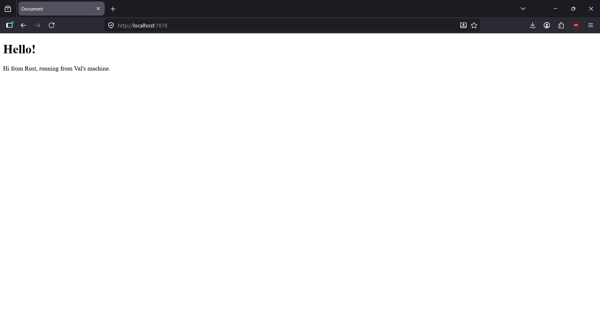

## Reflection 1 - `handle_connection()`

```Rust
 fn handle_connection(mut stream: TcpStream) {
    let buf_reader = BufReader::new(&mut stream);

    let http_request: Vec<_> = buf_reader
        .lines()
        .map(|result| result.unwrap())
        .take_while(|line| !line.is_empty())
        .collect();

    println!("Request: {:#?}", http_request)
}
```

- Fungsi ini mengambil `TcpStream` sebagai parameter. `TcpStream` merepresentasikan "koneksi" antara *client* dan *server*.
- `buf_reader` yang bertipe `BufReader` berfungsi untuk mengurus pembacaan *buffer* baris demi baris.
- `http_request` adalah sebuah *Vector* yang "mengoleksi" pesan-pesan request yang telah di-*format* sebelumya.

## Reflection 2 - Returning HTML



```Rust
fn handle_connection(mut stream: TcpStream) {
    let buf_reader = BufReader::new(&mut stream);

    let http_request: Vec<_> = buf_reader
        .lines()
        .map(|result| result.unwrap())
        .take_while(|line| !line.is_empty())
        .collect();

    let status_line = "HTTP/1.1 200 OK";

    let contents = fs::read_to_string("hello.html").unwrap();

    let length = contents.len();

    let response = format!("{status_line}\r\nContent-Length: {length}\r\n\r\n{contents}");

    stream.write_all(response.as_bytes()).unwrap();
}
```

- Fungsi `handle_connection` yang baru mengembalikan status 200 untuk koneksi berhasil.
- `fs::read_to_string("hello.html").unwrap();` membaca *file* HTML dan menjadikannya sebuah *string*.
- Selanjutnya, *response* dikembalikan dengan di-*format* terlebih dahulu dan diberikan *header* `Content-Length`.
- Data dikirim ke *stream*.
